```{r setup, include=FALSE}
knitr::opts_chunk$set(echo = TRUE)
library(dplyr)
```

## Comparison of Rose and Rho-adjusted Approaches

This document compares two ways to address stock assessments exhibiting retrospective problems in terms of stock status and catch advice. The Rose approach uses an ensemble of models that change the input data to remove the retrospective problem in different ways. It requires a fair amount of computing time to explore many options. The rho-adjusted approach modifies the terminal year estimates based on the Mohn's rho values. It has the challenge of a discontinuity at the end of the time series. This document walks the reader through two examples using Georges Bank Yellowtail Flounder and White Hake. These examples are provided for demonstration purposes only and should not be considered to provide guidance on the assessment of either stock.

## Georges Bank Yellowtail Flounder Example

### Background

The Georges Bank yellowtail flounder (GBYT) stock has been plagued by a strong retrospective pattern for many years. In 2014 a [benchmark assessment](https://nefsc.noaa.gov/saw/trac/) was conducted that rejected the anayltical modeling (then in VPA) in favor of an index-based approach due to the strong retrospective pattern. The data from the current index-based assessment was input to a statistical catch at age model (ASAP) for this demonstration and still exhibits a [strong retrospective pattern](GBYT/Rose/figs/GBYT.RETRO.PLOTS.pdf) with a 5 year Mohn's rho for spawning stock biomass of 2.14.

This assessment uses data from 1973-2018 for ages 1-6+ with three surveys providing tuning information. Recent survey values have been near or at time series lows. Recent quotas are well below historical catch amounts (hundreds of tons compared to tens of thousands of tons) with discards in the scallop fishery contributing a major source of the catch (discards were greater than landings in two recent years). This stock has not responded to recent low catches and continues to decline despite low quotas being set. Both missing catch and increased natural moratality have been explored previously as an explanation for the strong retrospective patterns in this stock assessment. However, the magnitude of the missing catch or amount of change required in M needed to remove the retrospective pattern was considered too large by review panels. The rho-adjustment approach was used in years prior to the VPA being rejected.

### Removing the GBYT retro

There are an infinite number of ways to remove a retrospective pattern by changing the input data. This demonstration focuses on a limited set of combinations. Either the catch or natural mortality rate is increased in recent years. The change from original to modified values can happen suddenly from one year to the next or with a linear ramp of 4 or 9 years. When natural mortality is modified, the increase can occur across all ages, only young ages (ages 1-3 in this case), or only old ages (ages 4-6+) in this case. The timing of the change was examined for years 1995, 2000, 2005, 2010, 2013, and 2015 being the first year of fully changed catch or natural mortality. The catch or natural mortality was modified by multiplication across all ages for catch or according the age range in the natural mortality scenario. This resulted in a total of 12 scenarios with 6 change years as possible ways to remove the retrospective pattern. For each scenario, a range of multipliers was applied to find the multiplier (to the nearest 0.1) that removed the retrospective pattern. Just over one thousand ASAP runs were conducted when searching for the multipliers that removed the retrospective pattern.

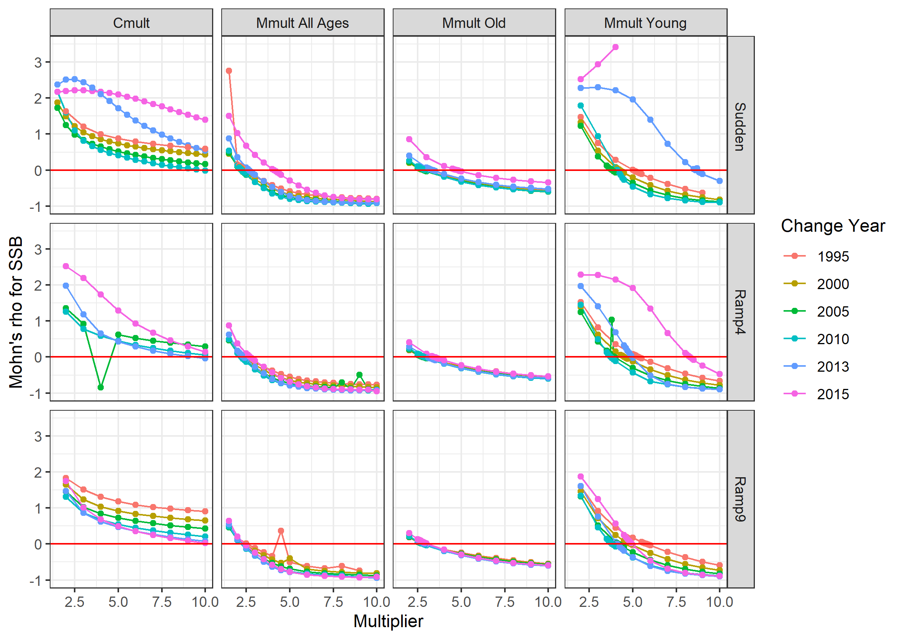

The plot shows that for most scenarios and change years, it was possible to find a multiplier less than 10 that removed the retrospective pattern (ssbrho = 0). However, there were some combinations that were unable to reduce the retrospective pattern sufficiently (e.g., many of the Cmult cases). There were also the occasional "blips" in the pattern of Mohn's rho for spawning stock biomass as the multiplier changed (e.g., Cmult-Ramp4-2005) due to one or more of the peels producting a dramatically different estimate of SSB. This means an automated system of finding a multiplier may not work well. Instead, an iterative approach was used with an initial large step size for the multipliers examined that was further refined.

To allow the greatest diversity of models in the Rose approach, the change year with the lowest absolute value of Mohn's rho for SSB for each scenario was selected as shown below.

````{r, echo=FALSE}
use12 <- read.csv("GBYT\\Rose\\saved\\use12table.csv", header = TRUE)
use12[, c(1:5, 7)]
````

These 12 scenarios all removed the retrospective pattern, but produced quite different estimates of SSB, F, and recruitemnt. In the plots below, the units are SSB in metric tons, F is the mean fishing mortality rate on ages 5-6+, and Recruitment in millions of fish. The solid blue line in each plot is the base case run. 

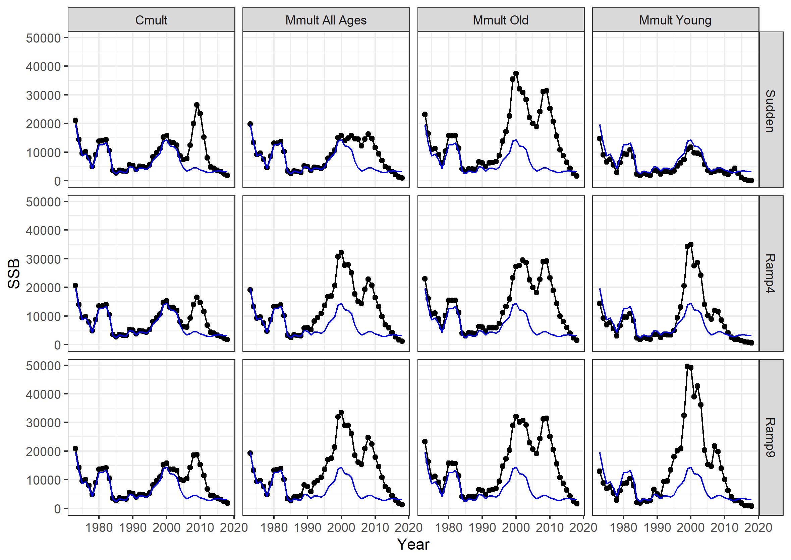

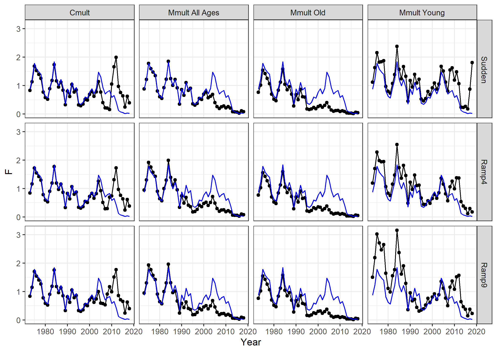

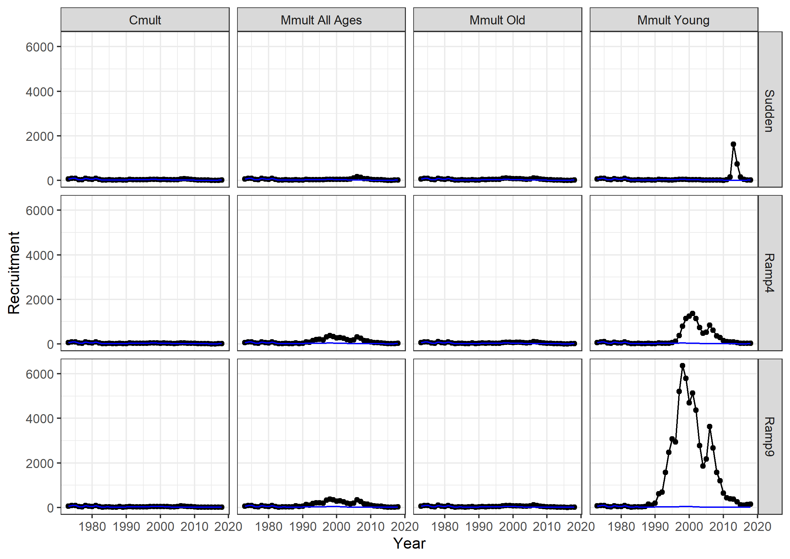

The natural mortality multipliers applied to young ages produced much higher recruitment estimates than any of the other scenarios. Limiting the range of recruitments plotted allows the other scenarios to be compared to the base case.

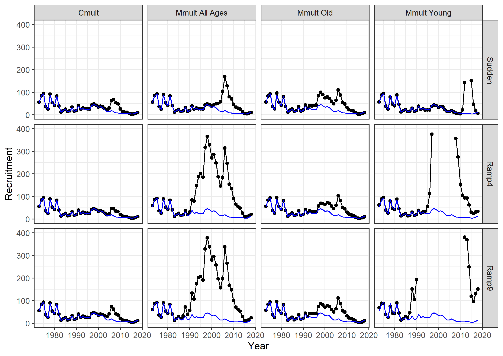


Of course, a Mohn's rho for SSB of zero is not the only diagnostic that should be considered in the Rose approach. Fits to the indices, parameter estimates at bounds or unbelievable values, fits to age composition data, etc. should all be considered. The table below provides a link to a pdf showing the model fits and results for each scenario. These can be compared to the [base run](GBYT/Rose/saved/GBYT.pdf). 

Ramp  | Cmult  | Mmult All Ages  | Mmult Old  | Mmult Young
----  | -----  | --------------  | ---------  | -----------
Sudden  | [1](GBYT/Rose/saved/scen01.pdf)  | [4](GBYT/Rose/saved/scen04.pdf)  | [7](GBYT/Rose/saved/scen07.pdf)  | [10](GBYT/Rose/saved/scen10.pdf)
Ramp4   | [2](GBYT/Rose/saved/scen02.pdf)  | [5](GBYT/Rose/saved/scen05.pdf)  | [8](GBYT/Rose/saved/scen08.pdf)  | [11](GBYT/Rose/saved/scen11.pdf)
Ramp9   | [3](GBYT/Rose/saved/scen03.pdf)  | [6](GBYT/Rose/saved/scen06.pdf)  | [9](GBYT/Rose/saved/scen09.pdf)  | [12](GBYT/Rose/saved/scen12.pdf)

Despite some troubling diagnostics for some scenarios, all 12 scenarios were kept for this demonstration. Actual application of the Rose approach would spend a lot of time evaluating which scenarios had good enough diagnostics to be considered in the ensemble approach. This consideration would be done before the catch advice was calculated to prevent picking scenarios to include based on the catch advice.

### GBYT Reference Points and Status

For the sake of simplicity, F40%SPR (the F that reduces spawning stock biomass per recruit to 40% of unexploited) was selected as the fishing mortality reference point. Of note, the natural mortality rate used in the calculation of F40% was the original value of 0.4, not a value at the end of the time series with M multipliers. This is because the time periods associated with the change in M are too short for the fish population to have evolved characteristics associated with this new M (see [Legault and Palmer 2016](https://doi.org/10.1139/cjfas-2015-0232) for more details). The weights and maturity at age were the same across all scenarios, only the fishery selectivity differed. The most recent time block (2008-2018) was used for the fishery selectivity for each run. Due to the relatively high M of 0.4 and the selectivity being to the right of the maturity ogive for all runs, the F40 values were quite high. As seen above, most runs estimated a much lower F value in the terminal year of the assessment, resulting in the F status being well below 1. However, there is one scenario (Young Sudden Mmults) that has a terminal year F of nearly 2 that is above the target F for that scenario. This one scenario has a strong influence on the Rose estimates. The terminal year SSB was always well below the target SSB, resulting in ratios well below 0.5 (the overfished definition in the US is typically half of SSBmsy or an SSBmsy proxy). For GBYT, the Rose status is the same as the rho-adjusted status with both estimating higher F ratios and lower SSB ratios compared to the original run. The changes in F and SSB ratios were greater for the Rose approach compared to the rho-adjusted approach for GBYT.  

````{r, echo=FALSE}
status_table <- read.csv("GBYT\\Rose\\saved\\status_table.csv", header = TRUE)
status_table %>%
  mutate(F_Terminal = sprintf("%0.3f", F_Terminal),
         F_Target = sprintf("%0.3f", F_Target),
         F_Ratio = sprintf("%0.3f", F_Ratio),
         SSB_Terminal = sprintf("%0.0f", SSB_Terminal),
         SSB_Target = sprintf("%0.0f", SSB_Target),
         SSB_Ratio = sprintf("%0.3f", SSB_Ratio))
````

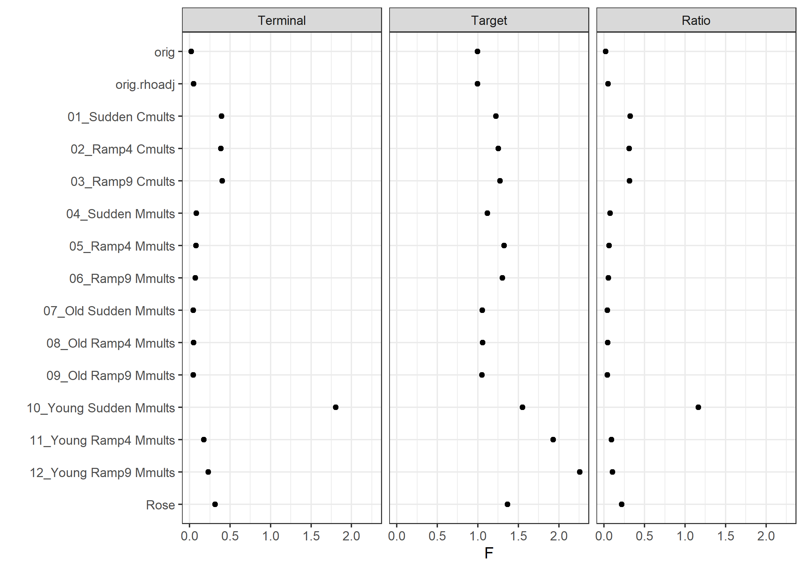

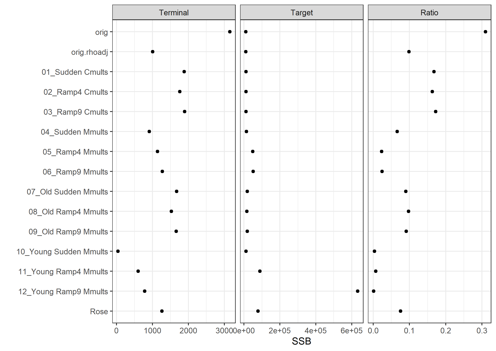

The Rose estimates are highlighted with a star symbol in the following three plots.

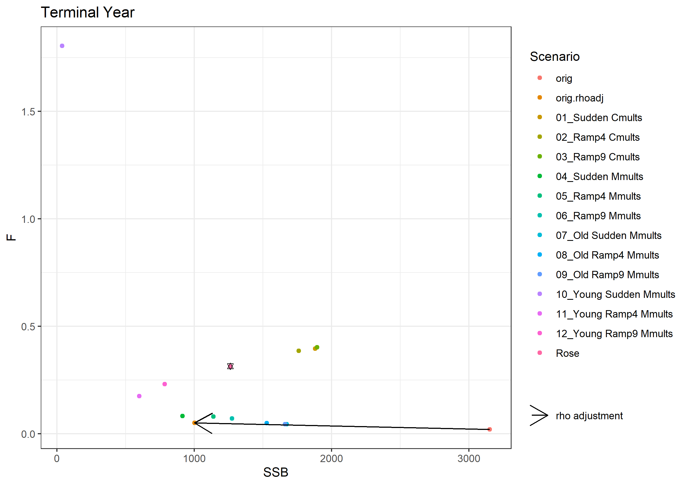

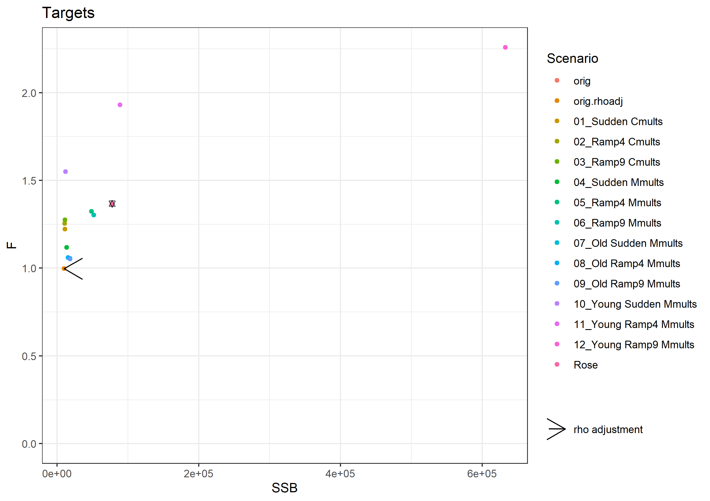

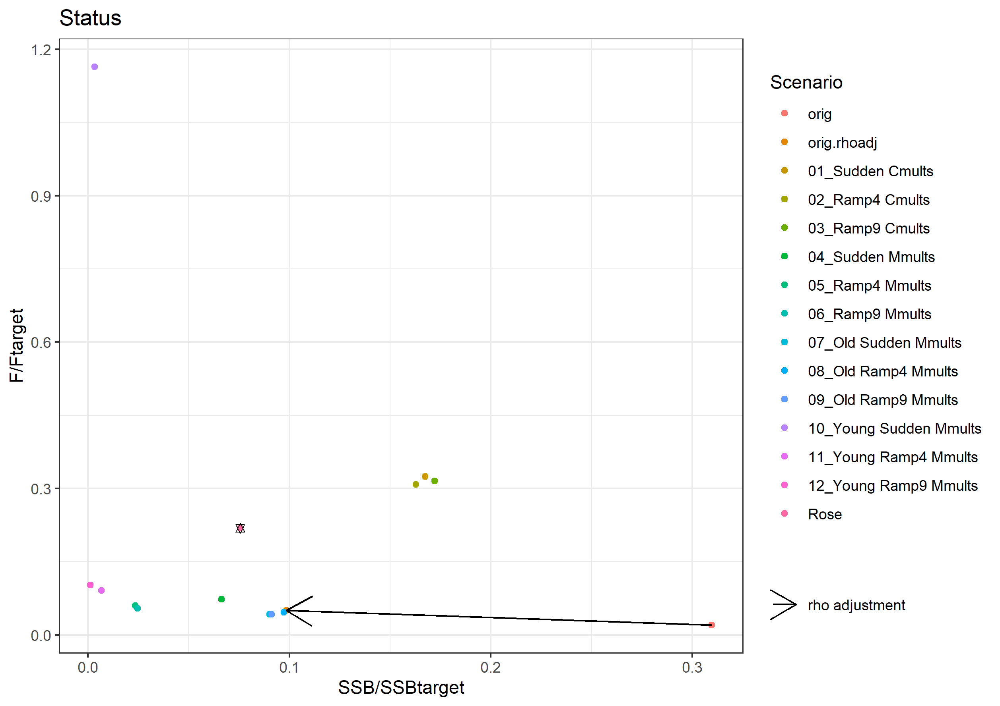


### GBYT Catch Advice

Catch advice was based on applying the target F for each scenario for three years. Two approached were used to adjust the terminal year plus one numbers at age for the rho-adjusted catch advice. One case applied the Mohn's rho for SSB to all ages while the other case used the age-specific Mohn's rho values to adjust the numbers at age. The adjustment was calculated as Nadj = Norig / (1 + rho). The Rose scenarios that used catch multipliers had the output catch divided by the catch multipliers because this missing catch in the assessment would not be expected to be suddenly available to the fishery in terms of reported catch. The Rose scenarios that used M multipliers continued the M from the terminal year in the assessment because there is no reason to expect the natural mortality rate to suddenly return to its original value in the projections. If the M was decreased in the projections, there would be "bonus" amount of fish suddenly available to the fishery as catch and to help rebuilding. 

The catch table and plot below shows the Rose approach providing lower catch advice than either rho-adjusted approach for GBYT in all three years.

````{r, echo=FALSE}
catch_advice <- read.csv("GBYT\\Rose\\saved\\catch_advice.csv", header = TRUE)
catch_advice %>%
  mutate(X2019 = sprintf("%0.0f", X2019),
         X2020 = sprintf("%0.0f", X2020),
         X2021 = sprintf("%0.0f", X2021))
````


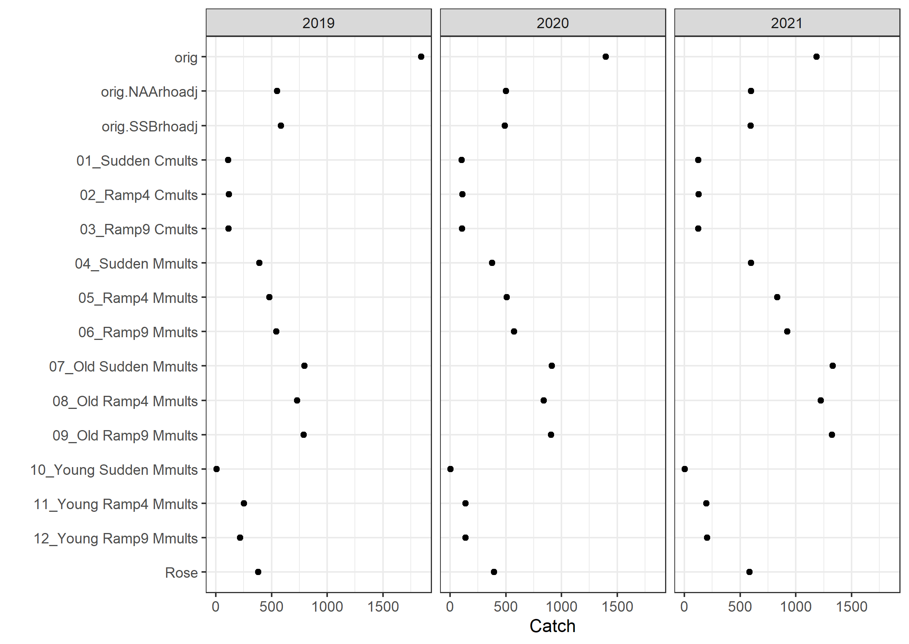


## White Hake example

### Background 
The white hake (WH) stock assessment was recently updated as part of a mangement track (local lingo meaning not a benchmark assessment). The stock exhibited a strong retrospective pattern based on 7 peels with Mohn's rho for SSB of 0.31. While strong, this is a much smaller retrospective pattern than the GBYT example above. Using the ICES standard of 5 peels, the Mohn's rho for SSB is 0.24, which still results in a strong retrospective pattern. 

This assessment uses data from 1963-2018 for ages 1-9+ with two surveys providing tuning information. Recent survey values have been near the medians of the time series. Recent quotas are below historical catch amounts (low thousands of tons compared to high thousands of thousands of tons). This stock has been slowly increasing in abundance in responded to recent low catches. There has not been a reason suggested for this retrospective pattern. The rho-adjustment approach has been used in recent years to determine stock status and catch advice (based on a 7 year peel). This example uses a 5 year peel for consistency with the standard in ICES.

### Removing the White Hake retro

For white hake, a systematic approach to removing the retrospective pattern was also applied. Either the catch or natural mortality rate is increased in recent years. The change from original to modified values can happen suddenly from one year to the next or with a linear ramp of 4 or 9 years. When natural mortality is modified, the increase can occur across all ages, only young ages (ages 1-4 in this case), or only old ages (ages 6-9+ in this case). The timing of the change was examined for years 2000, 2005, 2010, and 2015 being the first year of fully changed catch or natural mortality. The catch or natural mortality was modified by multiplication across all ages for catch or according the age range in the natural mortality scenario. This resulted in a total of 12 scenarios with 4 change years as possible ways to remove the retrospective pattern. For each scenario, a range of multipliers was applied to find the multiplier (to the nearest 0.1) that removed the retrospective pattern. A total of 555 ASAP runs were done to find these best multipliers for the 48 combinations.

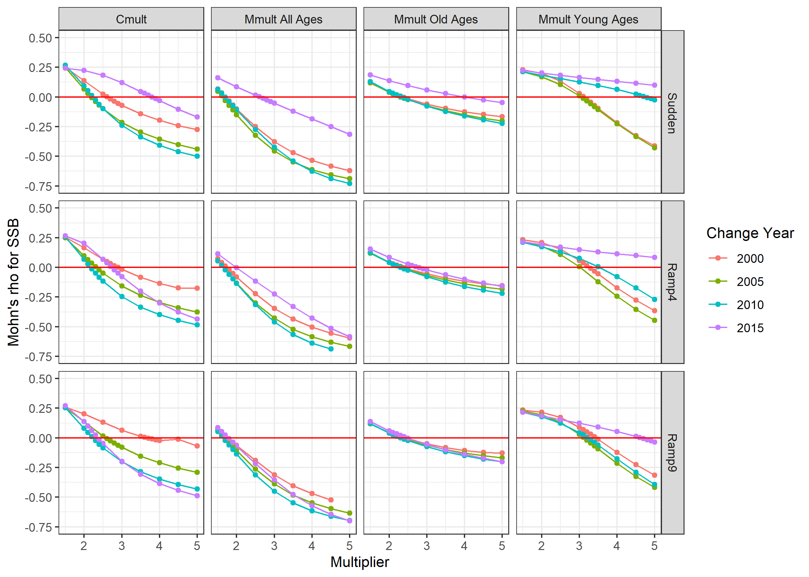

The plot shows that for all scenarios and change years, it was possible to find a multiplier less than 5 that removed the retrospective pattern (ssbrho within -0.013 to 0.100) as shown below. 

````{r, echo=FALSE}
bestruns <- read.csv("WhiteHake\\Rose\\saved\\bestruns.csv", header = TRUE)
bestruns[, c(1:5, 7)]
````

Since the original retrospective pattern was not as strong for white hake as it was for GBYT, the estimates of SSB, F, and recruitemnt did not vary as much. In the plots below, the units are SSB in metric tons, F is the mean fishing mortality rate on ages 6-9+, and Recruitment in millions of fish. The solid blue line in each plot is the base case run. 

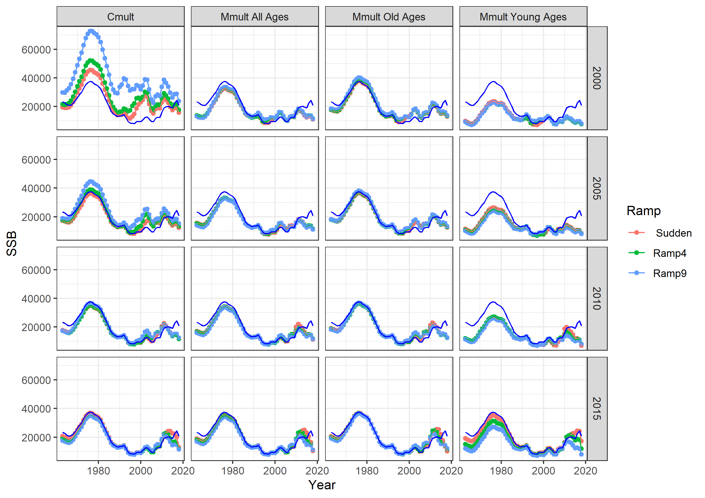

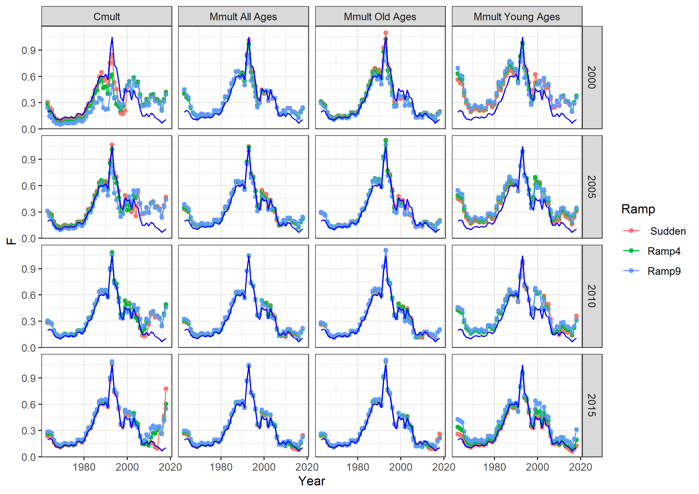

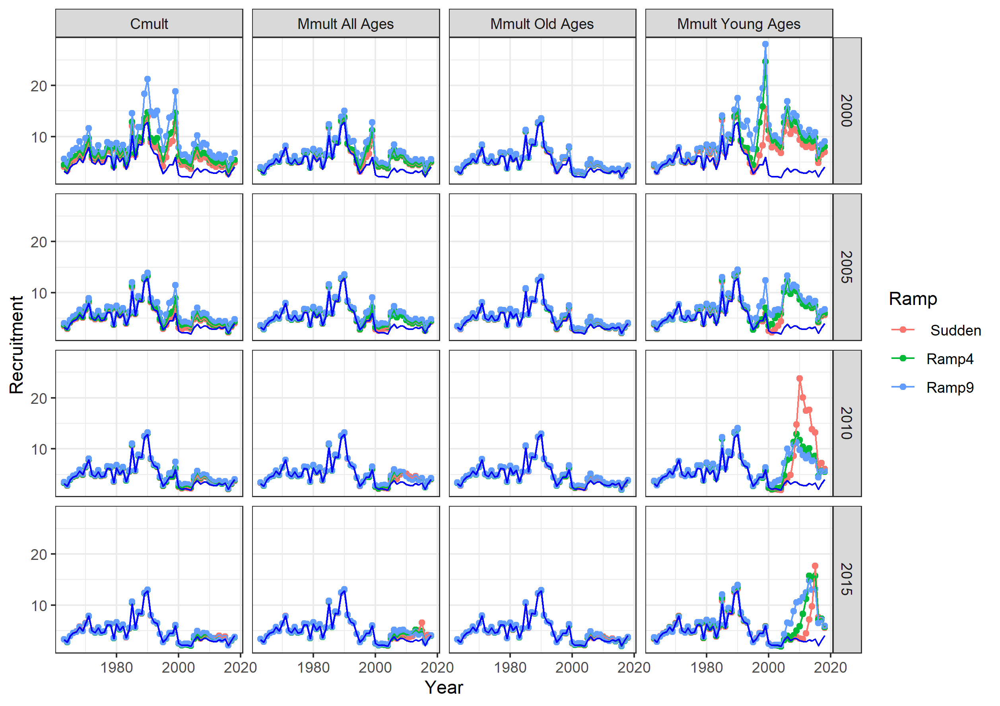

Of course, a Mohn's rho for SSB of zero is not the only diagnostic that should be considered in the Rose approach. Fits to the indices, parameter estimates at bounds or unbelievable values, fits to age composition data, etc. should all be considered. The 48 pdf files for the best runs can be found in the WhiteHake/Rose/saved directory with (hopefully) informative filenames. These can be compared to the [base run](WhiteHake/Rose/saved/whitehake.pdf). For this example, all 48 runs were included in the Rose approach without consideration of other diagnostics. 

### White Hake Reference Points and Status

For the sake of simplicity, F40%SPR (the F that reduces spawning stock biomass per recruit to 40% of unexploited) was selected as the fishing mortality reference point. Of note, the natural mortality rate used in the calculation of F40% was the original value of 0.2, not a value at the end of the time series with M multipliers. This is for the same reason noted above for GBYT. The weights and maturity at age were the same across all scenarios, only the fishery selectivity differed. The most recent time block (2008-2018) was used for the fishery selectivity for each run. The terminal year F is well below the target for the original run and the rho-adjusted run while most of the Rose scenarios and the Rose value are above 1. The rho-adjustment moves the F and F ratio in the same direction as the Rose approach, but not as far. The terminal year SSB is reduced by the rho adjustment but has a ratio that is above 0.5 while most of the Rose scenarios and the Rose value for the SSB ratio are below 0.5. Patterns can be seen within the groups of four change years for each scenario with more recent chagne years having lower F and SSB targets but inconsistent patterns for terminal year F and SSB, casuing the ratios to not follow strong patterns. These patterns in F targets can only be caused by changes in the selectivity of the fishery over time because the other inputs to the F40%SPR calculation are the same. The patterns in SSB targets can also be impacted by the recruitment estimates in the recent 10 years, which vary among the scenarios quite a bit (see plots above). For white hake, the rho-adjustment moved the F and SSB in the direction of the Rose estimates, but not as far as the Rose estimates, which is the same as in the GBYT example above. 

````{r, echo=FALSE}
status_table <- read.csv("WhiteHake\\Rose\\saved\\status_table.csv", header = TRUE)
status_table %>%
  mutate(F_Terminal = sprintf("%0.3f", F_Terminal),
         F_Target = sprintf("%0.3f", F_Target),
         F_Ratio = sprintf("%0.3f", F_Ratio),
         SSB_Terminal = sprintf("%0.0f", SSB_Terminal),
         SSB_Target = sprintf("%0.0f", SSB_Target),
         SSB_Ratio = sprintf("%0.3f", SSB_Ratio))
````

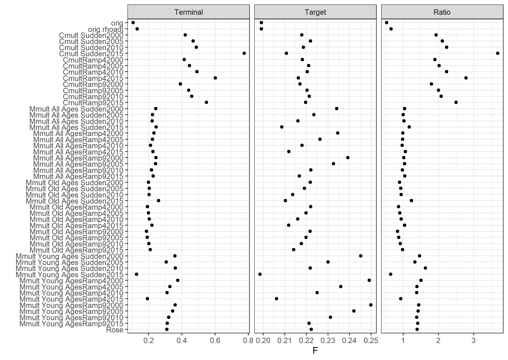

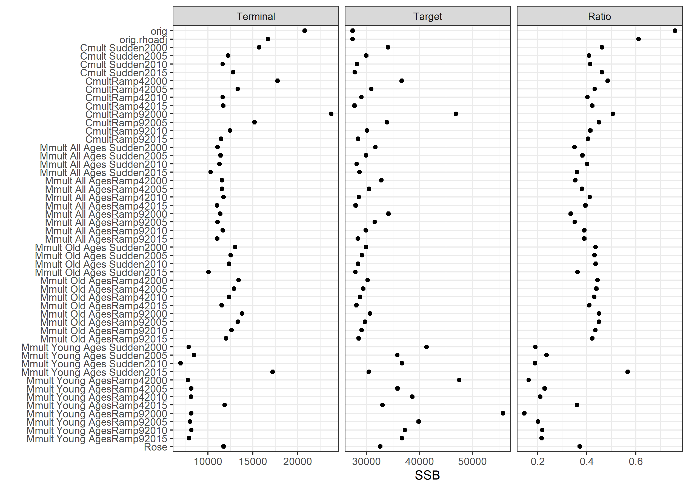

The Rose estimates are highlighted with a star symbol in the following three plots.

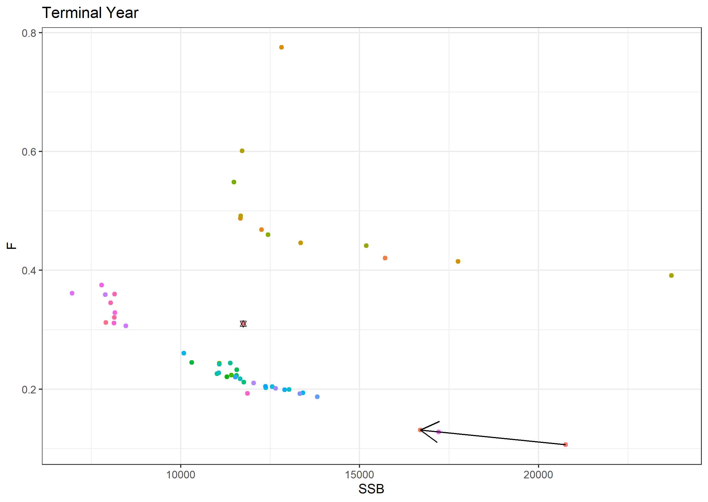

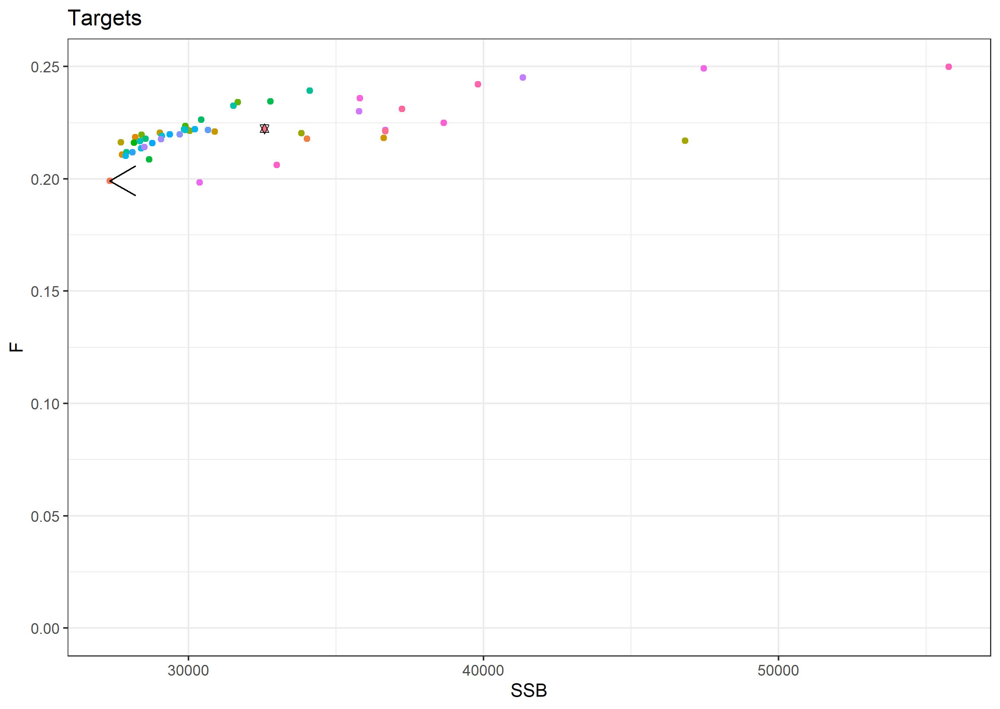

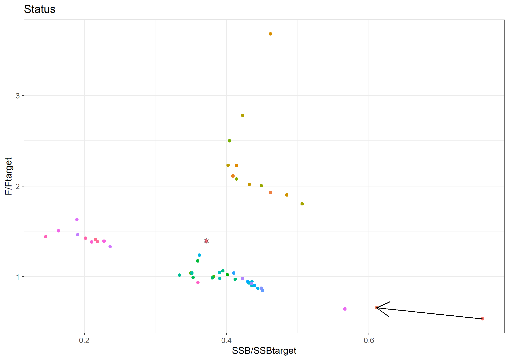

### White Hake Catch Advice

Catch advice was based on applying the target F for each scenario for three years. Two approached were used to adjust the terminal year plus one numbers at age for the rho-adjusted catch advice. One case applied the Mohn's rho for SSB to all ages while the other case used the age-specific Mohn's rho values to adjust the numbers at age. The adjustment was calculated as Nadj = Norig / (1 + rho). The Rose scenarios that used catch multipliers had the output catch divided by the catch multipliers because this missing catch in the assessment would not be expected to be suddenly available to the fishery in terms of reported catch. The Rose scenarios that used M multipliers continued the M from the terminal year in the assessment because there is no reason to expect the natural mortality rate to suddenly return to its original value in the projections. If the M was decreased in the projections, there would be "bonus" amount of fish suddenly available to the fishery as catch and to help rebuilding. 

The catch table and plot below shows the Rose approach providing lower catch advice than either rho-adjusted approach for white hake in all three years. This is the same result as for GBYT above.

````{r, echo=FALSE}
catch_advice <- read.csv("WhiteHake\\Rose\\saved\\catch_advice.csv", header = TRUE)
catch_advice %>%
  mutate(X2019 = sprintf("%0.0f", X2019),
         X2020 = sprintf("%0.0f", X2020),
         X2021 = sprintf("%0.0f", X2021))
````


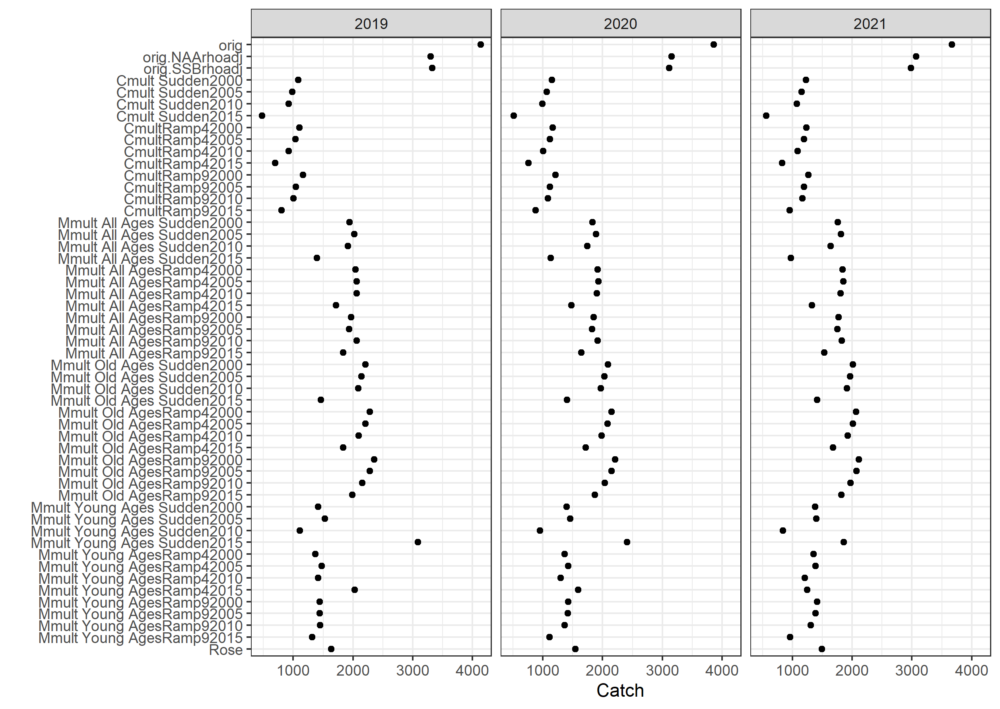

## Food for thought

During the WKFORBIAS meeting, survey catchability changes were suggested as an additional means of removing the retrospective pattern. To have control over the search process, index multipliers were applied to the data, similar to the catch and natural mortality multipliers. However, initial explorations were not successful with none of the sudden change year multipliers reducing the Mohn's rho for SSB close enough to zero for GBYT.

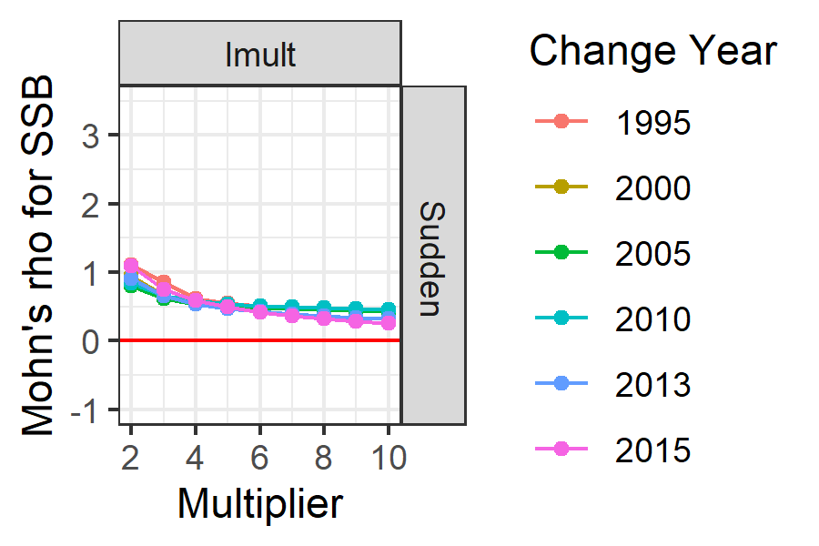

Only one of the four change years was able to reduce the Mohn's rho for SSB to zero for White Hake.

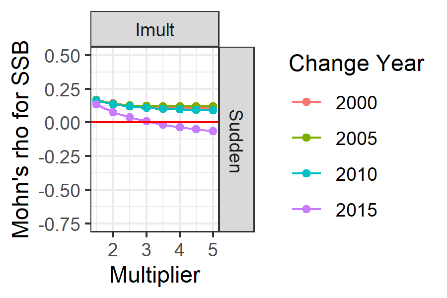

The use of index multiplier does not appear to be an easy way to remove retrospective patterns. More research is needed to determine how survey catchabilty can be more easily incorporated in the Rose approach.

Information not used in the model can sometimes provide additional support for or against scenarios in the Rose approach. For GBYT survey catchability studies have been conducted that allow an estimation of population biomass. The surveys were not used in this manner in the ASAP runs, so these estimates can provide an external check on the model estimates of biomass. The original ASAP run provides a much lower estimate of biomass than the expanded surveys for most years, and a different trend from the expanded surveys. However, the rho-adjusted terminal SSB estimate (red dot in 2018) is quite close to the expanded survey value. Many of the Rose scenario ASAP runs provide SSB time series that are similar to the expanded surveys, although the Mmults for young ages do not. This could be used as a basis for not including these scenarios in the Rose average. The blue polygons denote approximate 95% confidence intervals for the expanded survey biomass estimates.

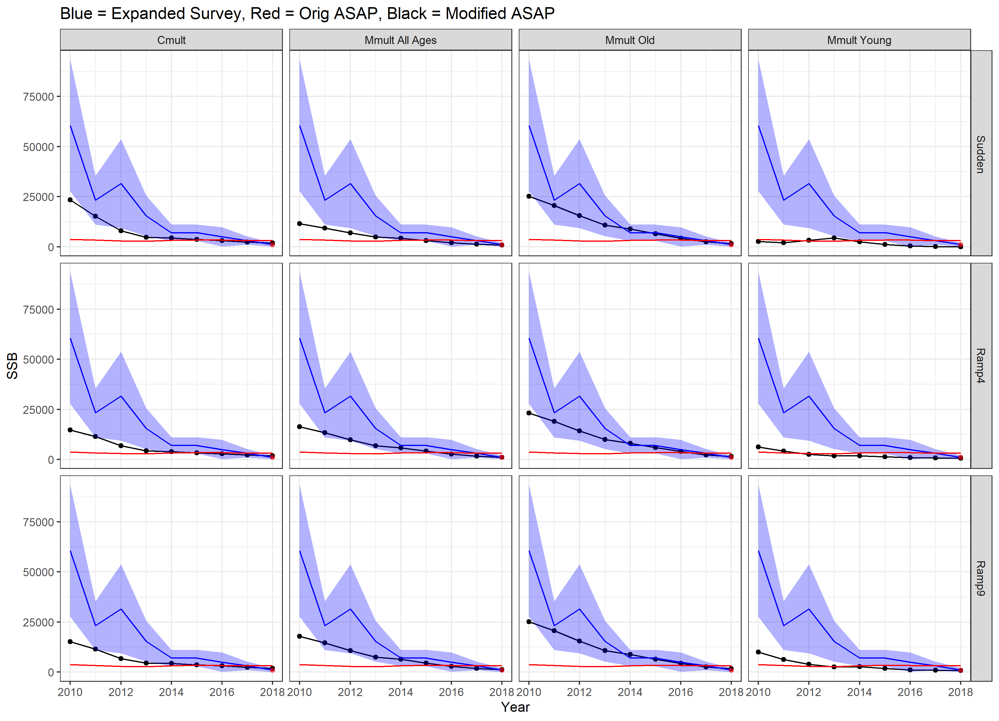

For demonstration purposes, all 12 scenarios are included in the following plot comparing the original, Rose, and rho-adjusted biomass estimates. 

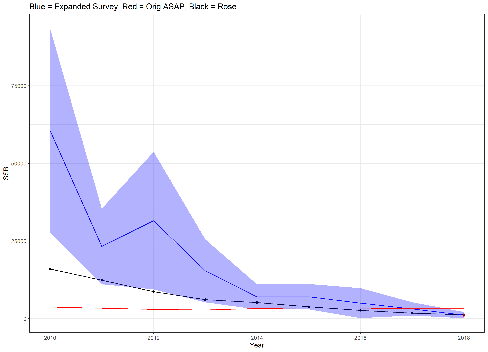

Expanded survey biomass estimates are not available for White Hake.

In both stocks, the rho-adjusted approach and Rose approach the F status point was increased and the SSB status point was decreased relative to the original run. The change due to the Rose approach was greater than from the rho-adjusted approach in both cases. Similarly, in both stocks the catch advice provided by both approaches as lower than the original run and the catch advice from the Rose approach was lower than the catch advice provided by the rho-adjustment. 

As seen in the GBYT example, the Rose approach can be influenced by one scenario that is quite different from the others. This influence could be reduced by using some other measure of central tendancy of the scenarios, such as the median or a trimmed mean. It would be better to make this decision before applying the Rose approach to eliminate any concern about basing the decision on the results.

The rho-adjusted approach does not impact the reference points in these examples because only the terminal year is adjusted. There is not a standard approach used to link the terminal year adjusted values back to the rest of the time series, resulting in a sudden discontinuity in the time series. This is one of the major concerns expressed with using the rho-adjusted approach. Another concern is that rho-adjusting the terminal year F and N does not necessarily result in the same catch that was originally predicted.

Approach  | Pros  | Cons
--------  | ----  | ----
Rose  | All models in ensemble have no retro  | Long run times  
Rose  | Addresses model structure uncertainty  | Potential stacking the deck  
Rho  | Easy and quick to compute  | Discontinuity in time series  
Rho  | Does not require identifying source of retro  | Ad hoc adjustment  


